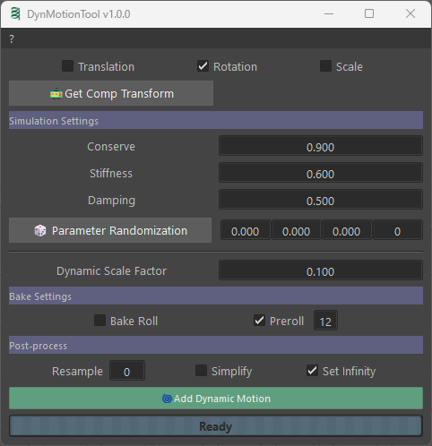

# DynMotionTool


**DynMotionTool for Maya 2025+ (Python 3.11+ and PySide6)**

- Add procedural secondary / follow-through motion to Maya transforms
- Does not require specific rigs and should work with any joint or any transform used as a control
- Can be used with animation layers (recommended workflow)
- Can be used in combination with my other tool [StickyTool](https://github.com/robotmitchum/stickyTool) to fake jiggle
  physics (use `Bake Roll` for this)



### UI features

- Hold mouse cursor over widgets to display tool tips<br/>
- Most numeric widgets feature context menus<br/>

## Installation

Copy the entire `dynMotionTool` directory to your `documents/maya/scripts`

This project was developed and tested with Maya 2025.<br/>
However, it should work in subsequent Maya versions or shipped with PySide6.

### Execution

In a python script tab or the python command line type or copy / paste and execute the following commands:

```python
import dynMotionTool.dyn_motion_tool_UI as dmt_ui
dmt_ui.DynMotionToolUI()
```

This can be put in a shelf button.<br/>
The tool icon `dynMotionTool_64.png` can be found in the `icons` subdirectory.

### Tips

- Use `Bake Roll` for rig parts attached with rivets-like nodes such as follicles or UV pins
- `Preroll` only really makes sense if the base animation has some motion outside of animation range.
  Animation outside of range does not have to be great. Most of the time, only an extended trajectory is good enough -
  it is required for proper motion blur on first and last frames anyway

## License

MIT License

Copyright (c) 2026 Michel 'Mitch' Pecqueur

Permission is hereby granted, free of charge, to any person obtaining a copy of this software and associated
documentation files (the "Software"), to deal in the Software without restriction, including without limitation the
rights to use, copy, modify, merge, publish, distribute, sublicense, and/or sell copies of the Software, and to permit
persons to whom the Software is furnished to do so, subject to the following conditions:

The above copyright notice and this permission notice shall be included in all copies or substantial portions of the
Software.

THE SOFTWARE IS PROVIDED "AS IS", WITHOUT WARRANTY OF ANY KIND, EXPRESS OR IMPLIED, INCLUDING BUT NOT LIMITED TO THE
WARRANTIES OF MERCHANTABILITY, FITNESS FOR A PARTICULAR PURPOSE AND NONINFRINGEMENT. IN NO EVENT SHALL THE AUTHORS OR
COPYRIGHT HOLDERS BE LIABLE FOR ANY CLAIM, DAMAGES OR OTHER LIABILITY, WHETHER IN AN ACTION OF CONTRACT, TORT OR
OTHERWISE, ARISING FROM, OUT OF OR IN CONNECTION WITH THE SOFTWARE OR THE USE OR OTHER DEALINGS IN THE SOFTWARE.